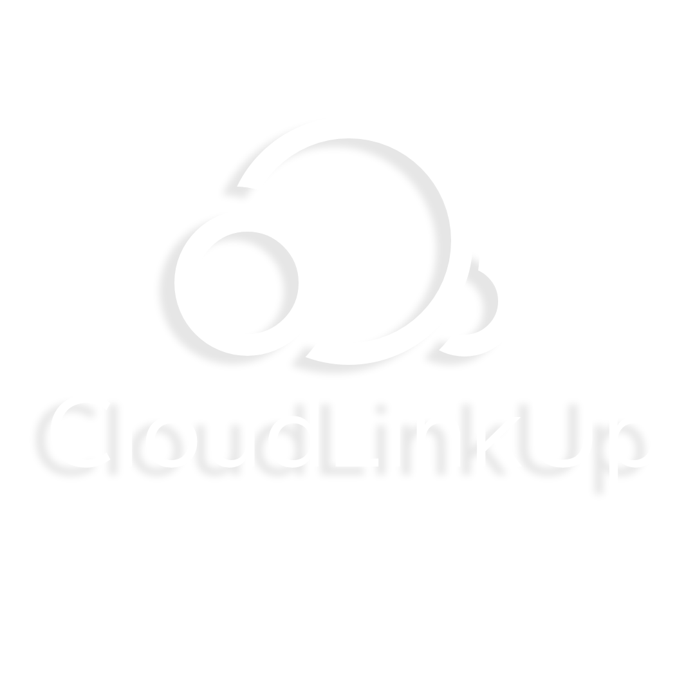

# CloudLinkUp

## Unleashing the Power of Decentralized AI Compute

**Welcome to the Future of AI Training**

### Links
- **DEMO LINK**: [cloudlinkup.streamlit.app](https://cloudlinkup.streamlit.app)  
- **X Profile**: [@CloudLinkUp](https://twitter.com/CloudLinkUp)

### About CloudLinkUp
CloudLinkUp revolutionizes AI model training by decentralizing compute power on the Solana blockchain. Our AI task distribution system strategically allocates resources to maximize efficiency and democratize access to AI compute.

### Our Mission
To make AI training accessible, privacy-centric, and economically viable for everyone, from individual developers to large corporations, by harnessing the unused power of global compute resources.

### What We Do
- **AI Task Distribution**: AI-driven resource allocation for optimal performance.
- **Privacy and Security**: Encrypted tasks to ensure data privacy.
- **Solana Integration**: Fast, secure, and low-cost transactions with escrow.

### Who We Are
**Lars Van Hoomissen** - Founder & Solo Developer  
I am carving the path for CloudLinkUp, working tirelessly alone to lay the groundwork for a team of dedicated innovators. I seek those willing to devote their lives to this project, to conquer the AI compute market together.

### Submission for Solana AI Hackathon
- [x] technical documentation
- [x] assessment of its potential impact
- [x] roadmap for scalability
- [x] A working prototype or MVP (Minimum Viable Product) must be provided.
- [x] The submission must be an original AI innovation built on Solana.

### Visuals

### Roadmap to Infinity
- **Phase 1**: Prototype & Beta Testing
- **Phase 2**: Expand Contributor & Client Base
- **Phase 3**: Global Reach & Network Optimization
- **Phase 4**: Continuous Innovation & Community Involvement

### Join the Revolution
CloudLinkUp is more than a project; it's a movement towards a new era of AI development. If you're passionate about shaping the future of AI compute, join us as we build this visionary platform.

---

**Note:** All links provided are placeholders. Replace them with actual links once your website and X profile are live.
